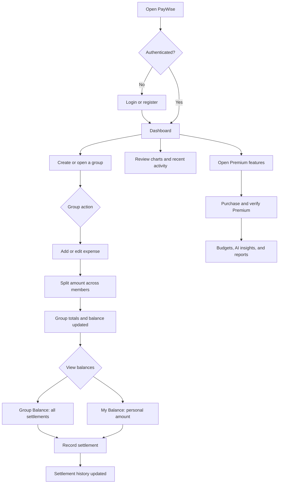
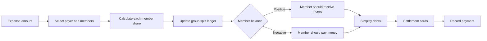
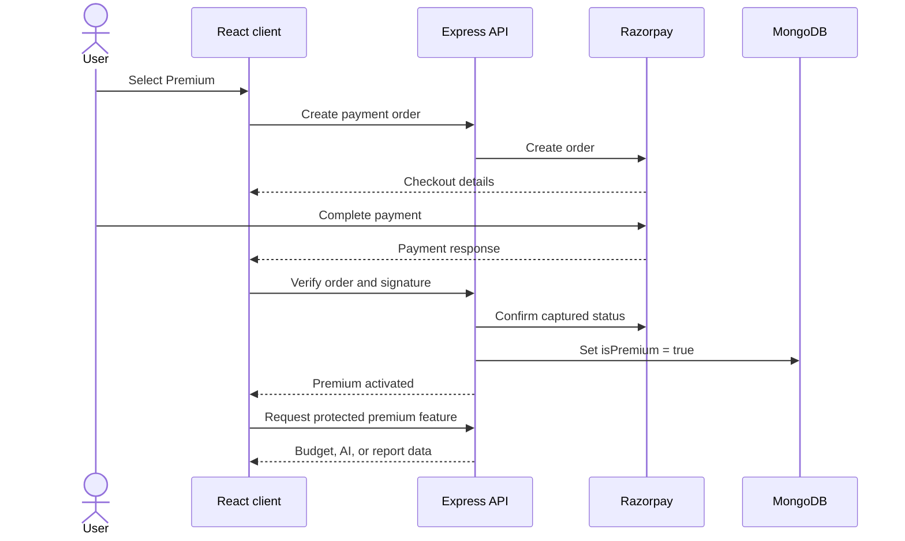
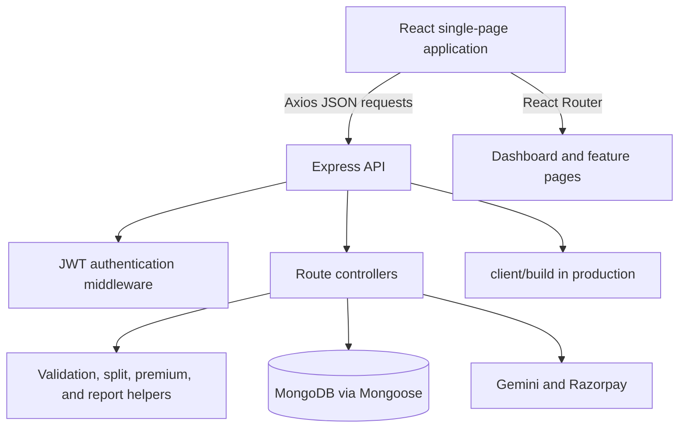

# PayWise

PayWise is a full-stack group expense management application. It allows users to create groups, record shared expenses, track each member's share, analyse spending, and settle outstanding balances.

The project contains a React single-page application, an Express API, and MongoDB persistence. During development, the React app runs on port `3000` and the API runs on port `3001`. In production, Express serves the compiled React app and the API from one server.

## Features

### Accounts and authentication

- User registration and login with email and password.
- Password hashing with bcryptjs.
- JWT access-token authentication for protected API operations.
- View and edit profile information.
- Change password or delete the account.
- Retrieve registered email addresses when adding group members.

### Groups

- Create groups with a name, description, category, currency, owner, and members.
- Add members using their registered email addresses.
- View all groups for the logged-in user.
- View, edit, and delete group details.
- Mark groups as favourites or remove them from favourites.
- Track group totals and member split balances.
- Validate supported currencies, including INR, USD, and EUR.

### Expenses

- Add, view, edit, and delete group expenses.
- Record an expense name, description, amount, category, currency, date, payer, members, and expense type.
- Automatically calculate each member's share.
- Automatically update group balances when expenses change.
- View all expenses for a group or all expenses involving a user.
- View a user's five most recent expenses.

### Settlements and analytics

- Calculate who owes money and who should receive money.
- Record settlements between group members.
- View a personal **My Balance** page with the current amount to pay or receive.
- See the members involved in each personal settlement and settle amounts directly.
- View settlement history for the group.
- Dashboard summary cards, recent transactions, and favourite groups.
- Group expense, category, monthly, and daily charts.
- Personal category, monthly, and daily spending charts.

### Premium features

Premium access is controlled by the server-side `User.isPremium` flag. Regular users can purchase Premium through Razorpay Checkout. The server creates the order, verifies the payment signature and captured status, and only then activates Premium. Users with `role: "admin"` bypass payment and receive Premium access for free.

To create an administrator, set `role: "admin"` directly in MongoDB. Admin accounts bypass the payment requirement. For a temporary manual Premium test account, set `isPremium: true`.

- Budget management with date ranges, currency, total spent, remaining amount, percentage used, status, and category insights.
- Gemini-powered AI Spending Assistant that aggregates the selected group's real expense data before sending only the required summary to Google Gemini.
- Filtered CSV exports and professional PDF reports containing group, period, category, member, settlement, and expense information.

## Technology stack

### Frontend

- React 18 and React Router 6
- Redux and React Redux
- Material UI and Styled Components
- Axios
- Chart.js and `react-chartjs-2`
- Formik and Yup

### Backend

- Node.js and Express
- MongoDB with Mongoose
- JSON Web Tokens
- bcryptjs
- CORS
- Winston and request logging

## Project structure

```text
PayWise/
├── app.js                  # Express server and API/frontend entry point
├── components/             # Backend controllers
├── helper/                 # Authentication, validation, logging, and split logic
├── model/                  # Mongoose schemas
├── routes/                 # Express API routers
├── client/
│   ├── public/              # Static frontend assets
│   └── src/
│       ├── components/      # React pages and reusable components
│       ├── layouts/          # Dashboard and authentication layouts
│       ├── services/         # Frontend services
│       ├── api/              # Axios API functions
│       └── routes.js         # Frontend route configuration
├── .env.example             # Environment variable template
├── package.json             # Backend and combined scripts
└── API_collection.json      # API request collection
```

## Application flow

The main user journey is:



### Balance calculation flow

Each group stores a running split value for every member. When an expense is added, the payer receives credit for the amount paid and each participating member is charged their share. Editing or deleting an expense reverses and recalculates the same values. The settlement calculator then simplifies the resulting credits and debits into direct payments:



## Product areas

### Dashboard

The dashboard provides a quick overview of the signed-in user's groups and spending activity. It includes total spending summaries, recent transactions, favourite groups, and personal spending charts.

### Groups

Groups are the central workspace for shared expenses. A group has a name, description, category, currency, owner, members, expenses, and a balance ledger. Supported currencies are INR, USD, and EUR.

Inside a group, users can:

1. Review total expenses and the amount they will pay or receive.
2. Browse expenses and open an individual expense.
3. View group-wide settlement recommendations.
4. Open **My Balance** for a personal view of amounts owed and amounts receivable.
5. Record settlements and review settlement history.
6. Review category and monthly spending visualisations.

### Premium workspace

Premium is enabled only after a verified Razorpay payment, unless the user has the `admin` role. The premium flow is:



Premium users can manage budgets, request AI spending insights, and generate filtered CSV/PDF reports. Premium API requests also validate authentication and group membership on the server.

## Architecture



### Request and authentication model

- The React client sends API requests through the Axios helpers in `client/src/api`.
- The API is mounted below `/api` in `app.js`.
- User registration and login are public; protected user, group, and expense operations require a bearer token.
- The token is sent as `Authorization: Bearer <access-token>`.
- Premium routes additionally check the user's premium status or administrator role and verify group membership.
- In development, the React proxy forwards `/api` requests to `http://localhost:3001`.
- In production, Express serves the compiled React application from `client/build`.

## Data model overview

The main MongoDB documents are:

| Model | Purpose |
| --- | --- |
| `User` | Account credentials, profile, role, premium status, and favourite groups |
| `Group` | Group metadata, members, currency, expenses ledger, and split balances |
| `Expense` | Amount, payer, participating members, category, date, and group reference |
| `Settlement` | Completed payment between two group members |
| `Budget` | Premium budget period, limits, category allocations, and group reference |

The stored group split ledger uses member email addresses as keys. Positive values represent money the member should receive; negative values represent money the member should pay.

## Requirements

- Node.js 18 or newer
- npm
- A MongoDB database, local or MongoDB Atlas

## Configuration

Create a `.env` file in the project root using `.env.example` as a template:

```env
PORT=3001
MONGODB_URI=<your-mongodb-connection-string>
ACCESS_TOKEN_SECRET=<random-secret-string>
DISABLE_API_AUTH=false
GEMINI_API_KEY=
GEMINI_API_URL=https://generativelanguage.googleapis.com/v1beta/models/gemini-2.5-flash:generateContent
GEMINI_MODEL=gemini-2.5-flash
RAZORPAY_KEY_ID=
RAZORPAY_KEY_SECRET=
RAZORPAY_WEBHOOK_SECRET=
PREMIUM_PRICE_PAISE=49900
```

`MONGODB_URI` and `ACCESS_TOKEN_SECRET` are required for normal operation. Keep `.env` private and do not commit it.

`GEMINI_API_KEY` is optional. If it is empty, the rest of PayWise continues working and only the AI assistant reports that it is not configured. Create the key in Google AI Studio, keep it on the backend, and never expose it in React code. Gemini availability and free-tier quotas depend on Google's current limits.

Razorpay requires a Key ID and Key Secret from the Razorpay Dashboard. `PREMIUM_PRICE_PAISE=49900` charges ₹499; Razorpay amounts are represented in the smallest currency unit. Configure `RAZORPAY_WEBHOOK_SECRET` for the `/api/payments/v1/webhook` endpoint.

Set `DISABLE_API_AUTH=true` only for temporary local API testing. It disables JWT checks on protected routes and must not be used in production.

## Run locally

From the project root, install both the backend and frontend dependencies:

```bash
npm install
cd client
npm install
cd ..
```

Configure `.env`, then start both applications together:

```bash
npm run dev
```

Open the frontend at [http://localhost:3000](http://localhost:3000). The backend API runs at [http://localhost:3001](http://localhost:3001).

You can also use two terminals:

```bash
# Terminal 1, from the project root
npm run server

# Terminal 2
cd client
npm start
```

The root command `npm start` starts only the backend. It does not start React and therefore does not print the frontend link.

## Production build

Build the React application from the project root:

```bash
npm run build
npm start
```

The build is written to `client/build`. Express serves this directory and provides the React SPA fallback. Open [http://localhost:3001](http://localhost:3001) after starting the production server.

## Frontend routes

- `/` — login
- `/register` — registration
- `/about` — about page
- `/dashboard/app` — dashboard
- `/dashboard/groups` — groups list
- `/dashboard/crateGroup` — create group page
- `/dashboard/groups/view/:groupId` — group details
- `/dashboard/groups/edit/:groupId` — edit group
- `/dashboard/addExpense/:groupId` — add expense
- `/dashboard/viewExpense/:expenseId` — view expense
- `/dashboard/editExpense/:expenseId` — edit expense
- `/dashboard/userProfile` — user profile

## API overview

All API endpoints are mounted under `/api`.

### Users

```text
POST   /api/users/v1/register
POST   /api/users/v1/login
POST   /api/users/v1/view
POST   /api/users/v1/edit
DELETE /api/users/v1/delete
POST   /api/users/v1/updatePassword
GET    /api/users/v1/emailList
```

### Groups

```text
POST   /api/group/v1/add
POST   /api/group/v1/view
POST   /api/group/v1/user
POST   /api/group/v1/edit
POST   /api/group/v1/makeFavourite
POST   /api/group/v1/removeFavourite
POST   /api/group/v1/settlement
POST   /api/group/v1/makeSettlement
DELETE /api/group/v1/delete
```

### Expenses and analytics

```text
POST   /api/expense/v1/add
POST   /api/expense/v1/edit
DELETE /api/expense/v1/delete
POST   /api/expense/v1/view
POST   /api/expense/v1/group
POST   /api/expense/v1/user
POST   /api/expense/v1/user/recent
POST   /api/expense/v1/group/categoryExp
POST   /api/expense/v1/group/monthlyExp
POST   /api/expense/v1/group/dailyExp
POST   /api/expense/v1/user/categoryExp
POST   /api/expense/v1/user/monthlyExp
POST   /api/expense/v1/user/dailyExp
```

### Premium APIs

```text
POST   /api/budget/list
POST   /api/budget/add
PUT    /api/budget/edit
DELETE /api/budget/delete
POST   /api/budget/summary
POST   /api/ai/v1/expense-insights
POST   /api/reports/v1/csv
POST   /api/reports/v1/pdf
POST   /api/reports/v1/summary
```

Every premium API authenticates the JWT, checks `isPremium` or the `admin` role, verifies group membership, and validates the requested group on the server.

### Payments

```text
POST /api/payments/v1/order
POST /api/payments/v1/verify
POST /api/payments/v1/webhook
```

Payment verification uses the Razorpay order ID stored on the server, HMAC-SHA256 signature verification, and a captured-payment status check before setting `User.isPremium` to `true`.

Protected endpoints require:

```http
Authorization: Bearer <access-token>
```

See [`API_collection.json`](API_collection.json) for the request collection.

## Available scripts

| Command | Description |
| --- | --- |
| `npm run dev` | Run backend and frontend together |
| `npm run server` | Run the backend with Nodemon |
| `npm run client` | Run the React frontend |
| `npm run build` | Build the frontend for production |
| `npm start` | Start the backend with Node.js |

From `client/`, `npm start` runs the React development server, `npm run build` creates the production frontend, and `npm test` runs frontend tests.

## Troubleshooting

### No clickable frontend link

Run `npm run dev` from the project root, or run `npm start` inside `client`. The frontend normally uses [http://localhost:3000](http://localhost:3000). Running root-level `npm start` starts only the API on port `3001`.

### Database connection errors

Check that `.env` is in the project root and that `MONGODB_URI` points to a reachable MongoDB instance. The backend logs `DB Connected` after a successful connection.

### Authentication errors

Log in through the frontend first so the JWT is stored in local storage. Protected requests must include the bearer token.

### Port already in use

Change `PORT` in `.env` for the backend. React will offer another available port if `3000` is already occupied.

## License

See [`LICENCE.md`](LICENCE.md) for license information.
